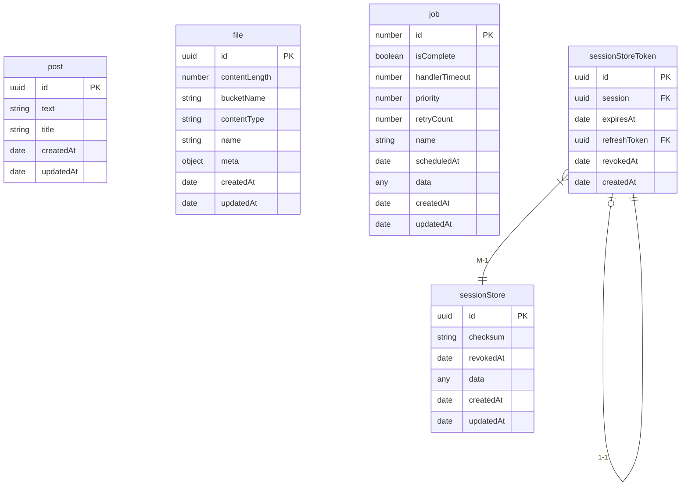

# ERD for defaultexp

```mermaid
erDiagram
    post {
        uuid id PK
        string text
        string title
        date createdAt
        date updatedAt
    }
    file {
        uuid id PK
        number contentLength
        string bucketName
        string contentType
        string name
        object meta
        date createdAt
        date updatedAt
    }
    job {
        number id PK
        boolean isComplete
        number handlerTimeout
        number priority
        number retryCount
        string name
        date scheduledAt
        any data
        date createdAt
        date updatedAt
    }
    sessionStore {
        uuid id PK
        string checksum
        date revokedAt
        any data
        date createdAt
        date updatedAt
    }
    sessionStoreToken {
        uuid id PK
        uuid session FK

        date expiresAt
        uuid refreshToken FK

        date revokedAt
        date createdAt
    }
    sessionStoreToken |o--|| sessionStoreToken : "1-1"
    sessionStoreToken }|--|| sessionStore : "M-1"
```
